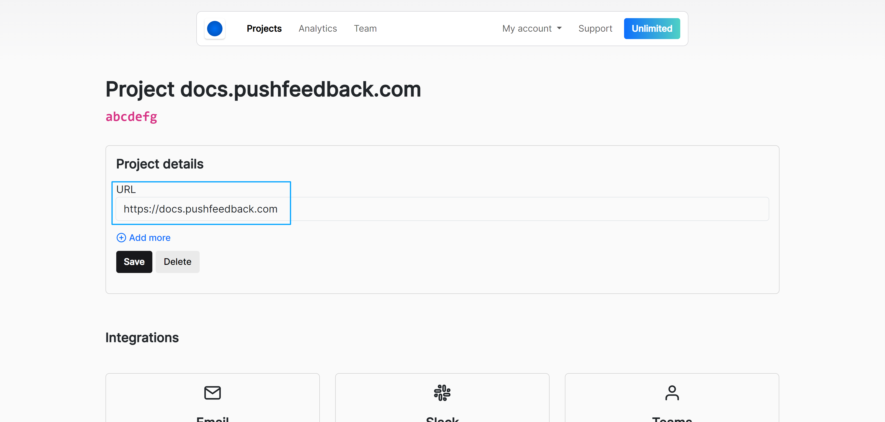
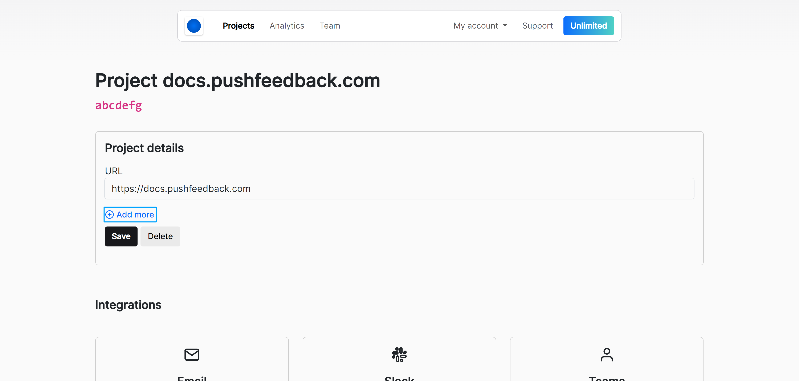

# Configure URLs

To ensure users can only submit feedback from your site, you must configure which URLs in your project allow the Feedback widget to be installed. This enhances security by restricting where feedback can be submitted from.

This guide explains how to configure URLs for your projects in PushFeedback.

## Basic configuration

Follow the steps below to configure an URL for your project:

1. Open [app.pushfeedback.com](https://app.pushfeedback.com).
2. Log in using your account credentials.
3. Once inside the dashboard, click **Projects** in the top navigation bar.
4. Select the project to configure.
5. Click **Settings**.
6. Under **Project details**, add your site URL. Example: `https://mywebsite.com`

    

7. Click **Save**.

## Additional URLs

:::info
This feature is only available on the [Unlimited](https://pushfeedback.com#pricing) plan.
:::

If you need to add more than one URL, such as for different services like staging, development, and production, but want to use the same integration without creating separate projects, you can list new URLs in the PushFeedback dashboard.

Follow the steps below to list additional URLs for your project:

1. Open [app.pushfeedback.com](https://app.pushfeedback.com).
2. Log in using your account credentials.
3. Once inside the dashboard, click **Projects** in the top navigation bar.
4. Select the project to configure.
6. Click **Settings**.
7. Under **Project details**, click on **+ Add more**.

    

5. Add additional URLS as needed.
5. Click **Save**.

:::tip
By default we add `localhost` and `127.0.0.0` so that you can test it in your local environment too.
You can remove them once you finish integrating the widget to prevent spam.
:::

By configuring your URLs correctly, you ensure that PushFeedback works across all your environments.

## Common error

If you encounter the error message:

```
The URL from which the request is made does not match the project URL.
```

This typically means that the URL where the widget is displayed has not been added to the project's allowed URLs list. Ensure that all relevant URLs are added to avoid this issue.
