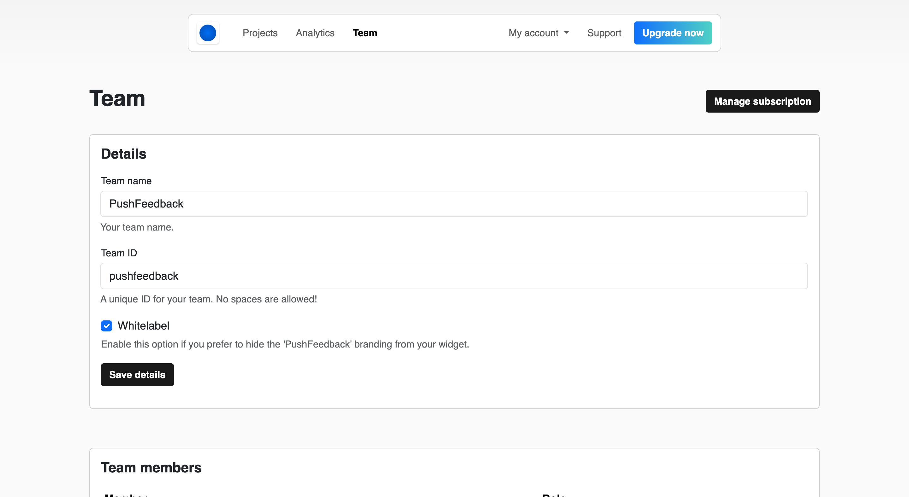

# Manage teams

From the **Team** view, you can:

* Change your team name.
* Enable / disable the PushFeedback logo.
* Invite new members.
* Delete members.
* Manage members.
* Manage your subscription.
* Delete your team.
