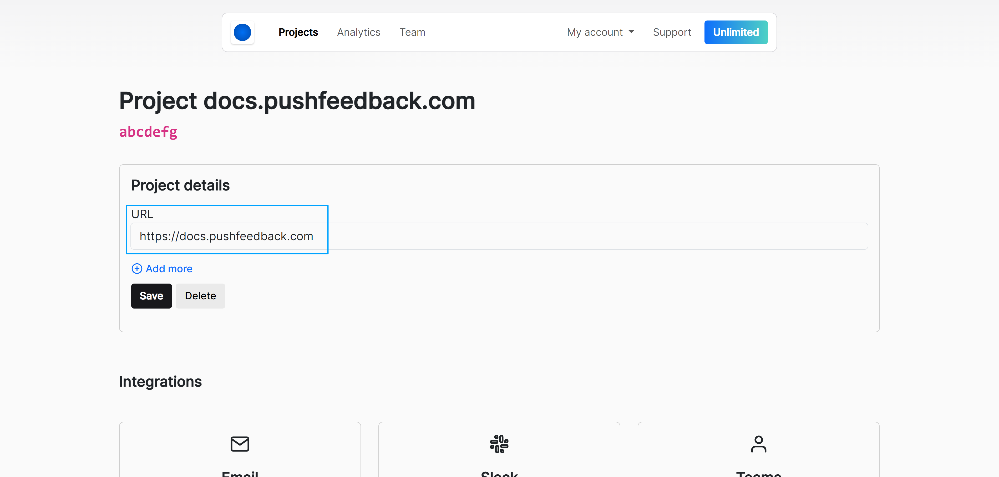
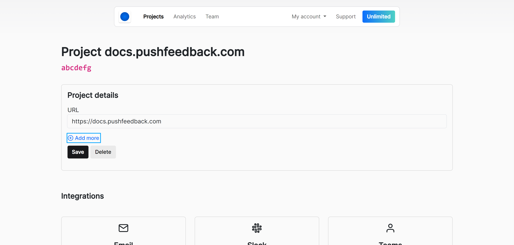

# Configure URLs

Each project has a list of allowed URLs. The feedback widget only works on domains in this list, preventing unauthorized use.

## Basic configuration

1. Open [app.pushfeedback.com](https://app.pushfeedback.com).
2. Log in using your account credentials.
3. Once inside the dashboard, click **Projects** in the top navigation bar.
4. Select the project to configure.
5. Click **Settings**.
6. Under **Project details**, add your site URL. Example: `https://mywebsite.com`

    

7. Click **Save**.

## Additional URLs

:::info
This feature is only available on the [Unlimited](https://pushfeedback.com#pricing) plan.
:::

If you need to add more than one URL, such as for different services like staging, development, and production, but want to use the same integration without creating separate projects, you can list new URLs in the PushFeedback dashboard.

1. Open [app.pushfeedback.com](https://app.pushfeedback.com).
2. Log in using your account credentials.
3. Once inside the dashboard, click **Projects** in the top navigation bar.
4. Select the project to configure.
6. Click **Settings**.
7. Under **Project details**, click on **+ Add more**.

    

5. Add additional URLS as needed.
5. Click **Save**.

:::tip
By default we add `localhost` and `127.0.0.0` so that you can test it in your local environment too.
You can remove them once you finish integrating the widget to prevent spam.
:::

## Common error

If you encounter the error message:

```
The URL from which the request is made does not match the project URL.
```

This typically means that the URL where the widget is displayed has not been added to the project's allowed URLs list. Ensure that all relevant URLs are added to avoid this issue.
