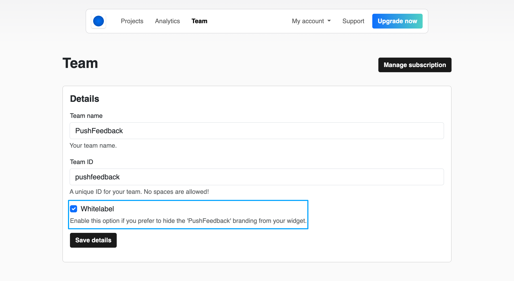

# Remove PushFeedback logo

:::info
This feature is only available on the [Professional](https://pushfeedback.com#pricing) and [Unlimited](https://pushfeedback.com#pricing) plans.
:::

White labeling hides the PushFeedback logo from the bottom of the feedback widget.

## Enable white labeling

1. Open [app.pushfeedback.com](https://app.pushfeedback.com) and log in.

2. Click **Team** in the top navigation bar.

3. Enable the **Whitelabel** option.

    

5. Click **Save**.

6. To ensure the changes are in place, go to any webpage where you've implemented the PushFeedback widget. The PushFeedback logo should no longer be visible at the bottom of the widget.
