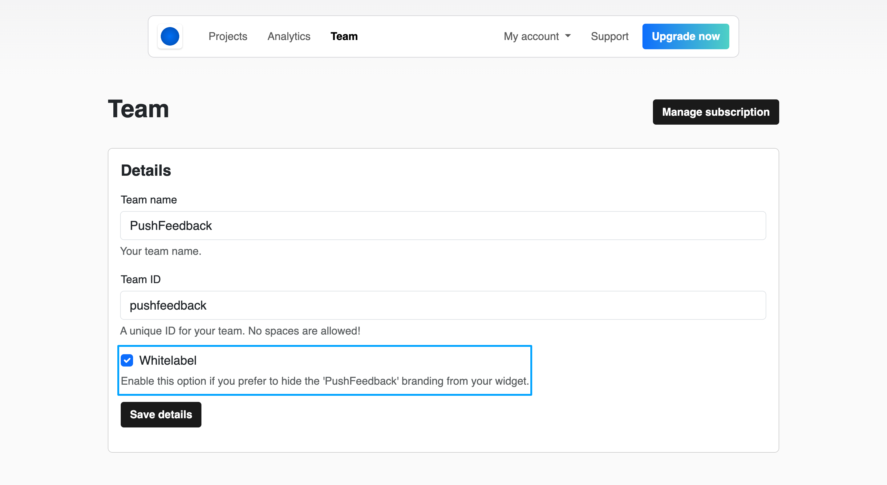

# Remove PushFeedback logo

:::info
This feature is only available on the [Professional](https://pushfeedback.com#pricing) and [Unlimited](https://pushfeedback.com#pricing) plans.
:::

PushFeedback offers a white labeling option which allows you to hide the PushFeedback logo from the bottom of the feedback widget.

## Steps

To enable this feature, follow these steps:

1. Open [app.pushfeedback.com](https://app.pushfeedback.com).

2. Log in using your account credentials.

3. Once inside the dashboard, click **Team** in the top navigation bar.

4. Look for the **Whitelabel** option. Activate this option to enable white labeling.

    

5. Click **Save**.

6. To ensure the changes are in place, go to any webpage where you've implemented the PushFeedback widget. The PushFeedback logo should no longer be visible at the bottom of the widget.
