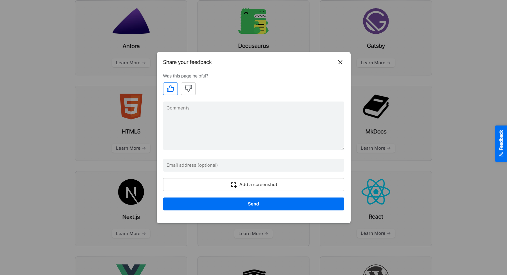
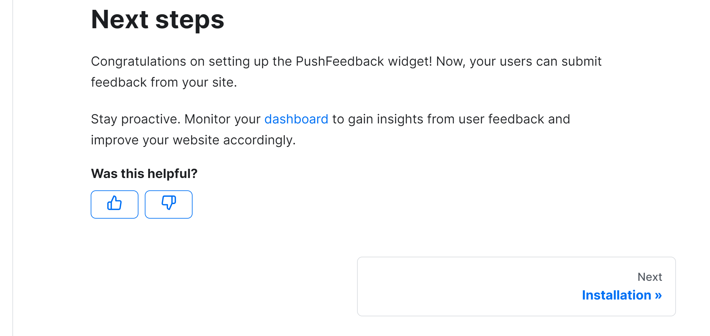

import Tabs from '@theme/Tabs';
import TabItem from '@theme/TabItem';

# Feedback widget for Docusaurus

Here's a step-by-step guide to help you install PushFeedback in your Docusaurus project using NPM.



## Prerequisites

Before you begin, you'll need to have the following:

- A PushFeedback account. If you don't have one, [sign up for free](https://app.pushfeedback.com/accounts/signup/).
- A project created in your PushFeedback dashboard. If you haven't created one yet, follow the steps in the [Quickstart](../quickstart.md#2-create-a-project) guide.
- A Docusaurus site and Node.js installed.

## Installation

To integrate the PushFeedback widget into your Docusaurus site:

1. Open your terminal or command prompt. Navigate to your project's root directory using the `cd` command:

    ```console
    cd path/to/your/project
    ```
    
    Replace `path/to/your/project` with your project's actual directory path.

1. With your terminal still open, run the following command to install PushFeedback:

    <Tabs>
    <TabItem value="3x" label="Docusaurus 3.x" default>

        npm install docusaurus-pushfeedback

    </TabItem>
    <TabItem value="2x" label="Docusaurus 2.X">

        npm install docusaurus-pushfeedback@0.1.7

    </TabItem>
    </Tabs>

1. Add the plugin to your Docusaurus config file `docusaurus.config.js`:

    ```js
    plugins: [
        [
            'docusaurus-pushfeedback',{
                project: '<YOUR_PROJECT_ID>'
            }
        ]
    ],
    ```

    Replace `<YOUR_PROJECT_ID>` with your project's ID from the [PushFeedback dashboard](../quickstart.md#2-create-a-project).

1. Start your Docusaurus project by running `npm start` or `yarn start` in your terminal. Once it compiles successfully, verify that the feedback button appears and functions correctly on your site.

    

## Customization

You can customize the PushFeedback widget to suit your needs. For example, you can change the widget's position, color, and more.

To do so, you can add any of the following [configuration](../configuration/layout.mdx) and [text](../configuration/text.mdx) options to the plugin or formatted as camelCase.

Here's an example:

```js
plugins: [
    [
        'docusaurus-pushfeedback',{
            project: '<YOUR_PROJECT_ID>',
            buttonPosition: 'center-right',
            modalPosition: 'sidebar-right',
            buttonStyle: 'dark',
            modalTitle: 'Share your thoughts'
        }
    ]
],
```

To further customize the style of the PushFeedback widget in Docusaurus, such as altering the widget's background color, you can override specific CSS properties. This is done by defining these properties in a custom stylesheet. Here's how you can do it:

1. In your project's `src` directory, create the file `css/custom.css`.

1. In the `custom.css` file, you can define your custom CSS properties. For example, to change the widget's primary color, add the following CSS rule:

    ```css
    :root {
        --feedback-primary-color: #FF0000; /* Replace #FF0000 with the hex color code of your choice */
    }
    ```

    For a complete reference of properties you can modify, see the [Styles](../configuration/styles) documentation.

1. Open your `docusaurus.config.js` file and locate the `presets` array and within it, the `classic` preset configuration. Then, add a reference to your custom stylesheet in the theme configuration. It should look something like this:

    ```js
    presets: [
        [
            'classic',
            {
            // ... other configurations ...
            theme: {
                customCss: require.resolve('./src/css/custom.css'), // Add this line
            },
            // ... other configurations ...
            },
        ],
    ],
    ```

## Advanced setup: Custom placement with Swizzling

This alternative installation method is best for those projects that require granular control over the widget's positioning.

For example, you can use it to embedded PushFeedback at the end of every page as follows:



To integrate the PushFeedback widget into your Docusaurus site:

1. Open your terminal or command prompt. Navigate to your project's root directory using the `cd` command:

    ```console
    cd path/to/your/project
    ```
    
    Replace `path/to/your/project` with your project's actual directory path.

1. With your terminal still open, run the following command to install PushFeedback:

    ```console
    npm install pushfeedback-react
    ```

    :::tip
    In this setup, the `docusaurus-pushfeedback` package is not required. You can uninstall it by running `npm uninstall docusaurus-pushfeedback`.
    :::

1. For Docusaurus, the best approach is to swizzle the original doc footer component to embed the PushFeedback button. Begin by using the npm run swizzle command to start the swizzle process:

    ```console
    npm run swizzle @docusaurus/theme-classic DocItem/Footer
    ```

    When prompted with the question: `Which swizzle action do you want to do?`, choose **Wrap**.

    By choosing to wrap, Docusaurus will create a wrapper component for the Footer in the `src/theme` directory. This allows you to extend the original footer component without modifying its intrinsic content.

1. After swizzling, navigate to `src/theme/DocItem/Footer/index.js` in your project directory. Now, integrate the PushFeedback button:

    ```js
    import React, {useEffect} from 'react';
    import Footer from '@theme-original/DocItem/Footer';
    
    import { FeedbackButton } from 'pushfeedback-react';
    import { defineCustomElements } from 'pushfeedback/loader';
    import 'pushfeedback/dist/pushfeedback/pushfeedback.css';

    function FeedbackWidget() {
        const buttonThumbsUp = <svg xmlns="http://www.w3.org/2000/svg" width="20" height="20" viewBox="0 0 24 24" fill="none" stroke="currentColor" strokeWidth="2" strokeLinecap="round" strokeLinejoin="round"><path d="M14 9V5a3 3 0 0 0-3-3l-4 9v11h11.28a2 2 0 0 0 2-1.7l1.38-9a2 2 0 0 0-2-2.3zM7 22H4a2 2 0 0 1-2-2v-7a2 2 0 0 1 2-2h3"></path></svg>;
        const buttonThumbsDown = <svg xmlns="http://www.w3.org/2000/svg" width="20" height="20" viewBox="0 0 24 24" fill="none" stroke="currentColor" strokeWidth="2" strokeLinecap="round" strokeLinejoin="round"><path d="M10 15v4a3 3 0 0 0 3 3l4-9V2H5.72a2 2 0 0 0-2 1.7l-1.38 9a2 2 0 0 0 2 2.3zm7-13h2.67A2.31 2.31 0 0 1 22 4v7a2.31 2.31 0 0 1-2.33 2H17"></path></svg>;
        // Replace with your PROJECT_ID
        const projectId = '<PROJECT_ID>';

        useEffect(() => {
            if (typeof window !== 'undefined') {
                defineCustomElements(window);
            }
        }, []);

        return(
            <div className="feedback-widget margin-top--md margin-bottom--md">
                <div className="margin-bottom--sm">
                    <b>Was this helpful?</b>
                </div>
                <span class="feedback-widget-positive">
                    <FeedbackButton project={projectId} rating="1" custom-font="True" button-style="default" modal-position="center">
                        <button className="button button--outline button--primary button--sm" title="Yes">
                            {buttonThumbsUp}
                        </button>
                    </FeedbackButton>
                </span>
                <span class="feedback-widget-negative margin-left--sm">
                    <FeedbackButton project={projectId} rating="0" custom-font="True" button-style="default" modal-position="center">
                        <button className="button button--outline button--primary button--sm" title="No">
                            {buttonThumbsDown}
                        </button>
                    </FeedbackButton>
                </span>
            </div>
        );
    }

    export default function FooterWrapper(props) {
        return (
            <>
            <FeedbackWidget/>
            <Footer {...props} />
            </>
        );
    }
    ```

    Replace `<PROJECT_ID>` with your project's ID from the [PushFeedback dashboard](../quickstart.md#2-create-a-project).
    
1. Start your Docusaurus project by running `npm start` or `yarn start` in your terminal. Once it compiles successfully, verify that the feedback button appears and functions correctly on your site.

## Advanced setup: Multilingual support

This installation method is best for projects that need to support multiple languages.

Example:


:::info
Before you start with this guide, your docusaurus site must have [i18n](https://docusaurus.io/docs/i18n/tutorial) enabled.
:::

To integrate the PushFeedback widget into your Docusaurus site:

1. Open your terminal or command prompt. Navigate to your project's root directory using the `cd` command:

    ```console
    cd path/to/your/project
    ```
    
    Replace `path/to/your/project` with your project's actual directory path.

1. With your terminal still open, run the following command to install PushFeedback:

    ```console
    npm install pushfeedback-react
    ```

    :::tip
    In this setup, the `docusaurus-pushfeedback` package is not required. You can uninstall it by running `npm uninstall docusaurus-pushfeedback`.
    :::

1. For Docusaurus, the best approach is to swizzle the original footer component to embed the PushFeedback button. This ensures the feedback button is loaded just before the closing body tag for optimal performance. Begin by using the npm run swizzle command to start the swizzle process:

    ```console
    npm run swizzle @docusaurus/theme-classic Footer
    ```

    When prompted with the question: `Which swizzle action do you want to do?`, choose **Wrap**.

    By choosing to wrap, Docusaurus will create a wrapper component for the Footer in the `src/theme` directory. This allows you to extend the original footer component without modifying its intrinsic content.

1. After swizzling, navigate to `src/theme/Footer/index.js` in your project directory. Replace the content with the following to integrate the PushFeedback button:

    ```js
    import React, { useEffect } from 'react';
    import Footer from '@theme-original/Footer';
    import useDocusaurusContext from '@docusaurus/useDocusaurusContext';
    import { FeedbackButton } from 'pushfeedback-react';
    import { defineCustomElements } from 'pushfeedback/loader';
    import 'pushfeedback/dist/pushfeedback/pushfeedback.css';

    function FeedbackWidget() {
        const { i18n } = useDocusaurusContext();
        const language = i18n.currentLocale;
        // Replace with your actual project ID
        const projectId = '<PROJECT_ID>'; 

        // Replace with your project supported languages
        const placeholders = {
            en: {
                feedbackButtonText: "Feedback",
                emailPlaceholder: "Enter your email",
                errorMessage: "Please try again later.",
                modalTitleError403: "The request URL does not match the one defined in PushFeedback for this project.",
                modalTitleError404: "We could not find the provided project id in PushFeedback.",
                messagePlaceholder: "Comments",
                modalTitle: "Share your feedback",
                modalTitleError: "Oops!",
                modalTitleSuccess: "Thanks for your feedback!",
                screenshotButtonText: "Take a Screenshot",
                screenshotTopbarText: "SELECT AN ELEMENT ON THE PAGE",
                sendButtonText: "Send",
                ratingPlaceholder: "Was this page helpful?",
                ratingStarsPlaceholder: "How would you rate this page"
            },
            es: {
                feedbackButtonText: "Sugerencias",
                emailPlaceholder: "Ingrese su correo electrónico",
                errorMessage: "Inténtalo de nuevo más tarde.",
                modalTitleError403: "La URL de solicitud no coincide con la definida en PushFeedback para este proyecto.",
                modalTitleError404: "No pudimos encontrar el ID del proyecto proporcionado en PushFeedback.",
                messagePlaceholder: "Comentarios",
                modalTitle: "Danos tu opinión",
                modalTitleError: "¡Vaya!",
                modalTitleSuccess: "¡Gracias por tus comentarios!",
                screenshotButtonText: "Tomar una captura de pantalla",
                screenshotTopbarText: "SELECCIONA UN ELEMENTO EN LA PÁGINA",
                sendButtonText: "Enviar",
                ratingPlaceholder: "¿Fue útil esta página?",
                ratingStarsPlaceholder: "¿Cómo calificarías esta página?"
            }
        };

        useEffect(() => {
            if (typeof window !== 'undefined') {
                defineCustomElements(window);
            }
        }, []);

        const {
            feedbackButtonText,
            emailPlaceholder,
            errorMessage,
            modalTitleError403,
            modalTitleError404,
            messagePlaceholder,
            modalTitle,
            modalTitleError,
            modalTitleSuccess,
            screenshotButtonText,
            screenshotTopbarText,
            sendButtonText,
            ratingPlaceholder,
            ratingStarsPlaceholder
        } = placeholders[language] || placeholders.en;

        return (
            <div className="feedback-widget">
                <FeedbackButton
                    project={projectId}
                    email-placeholder={emailPlaceholder}
                    error-message={errorMessage}
                    modal-title-error-4-0-3={modalTitleError403}
                    modal-title-error-4-0-4={modalTitleError404}
                    message-placeholder={messagePlaceholder}
                    modal-title={modalTitle}
                    modal-title-error={modalTitleError}
                    modal-title-success={modalTitleSuccess}
                    screenshot-button-text={screenshotButtonText}
                    screenshot-topbar-text={screenshotTopbarText}
                    send-button-text={sendButtonText}
                    rating-placeholder={ratingPlaceholder}
                    rating-stars-placeholder={ratingStarsPlaceholder}
                    button-position="bottom-right"
                    button-style="dark"
                    modal-position="bottom-right"
                >
                {feedbackButtonText}
                </FeedbackButton>
            </div>
        );
    }

    export default function FooterWrapper(props) {
        return (
            <>
                <Footer {...props} />
                <FeedbackWidget />
            </>
        );
    }
    ```

    Replace `<PROJECT_ID>` with your project's ID from the [PushFeedback dashboard](../quickstart.md#2-create-a-project) and the placeholder strings with your project's supported languages.

1. Start your Docusaurus project by running `npm start` or `yarn start` in your terminal. Once it compiles successfully, verify that the feedback button appears and functions correctly on your site.
