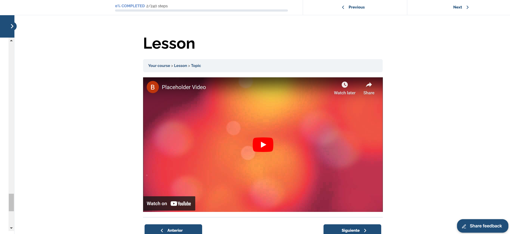
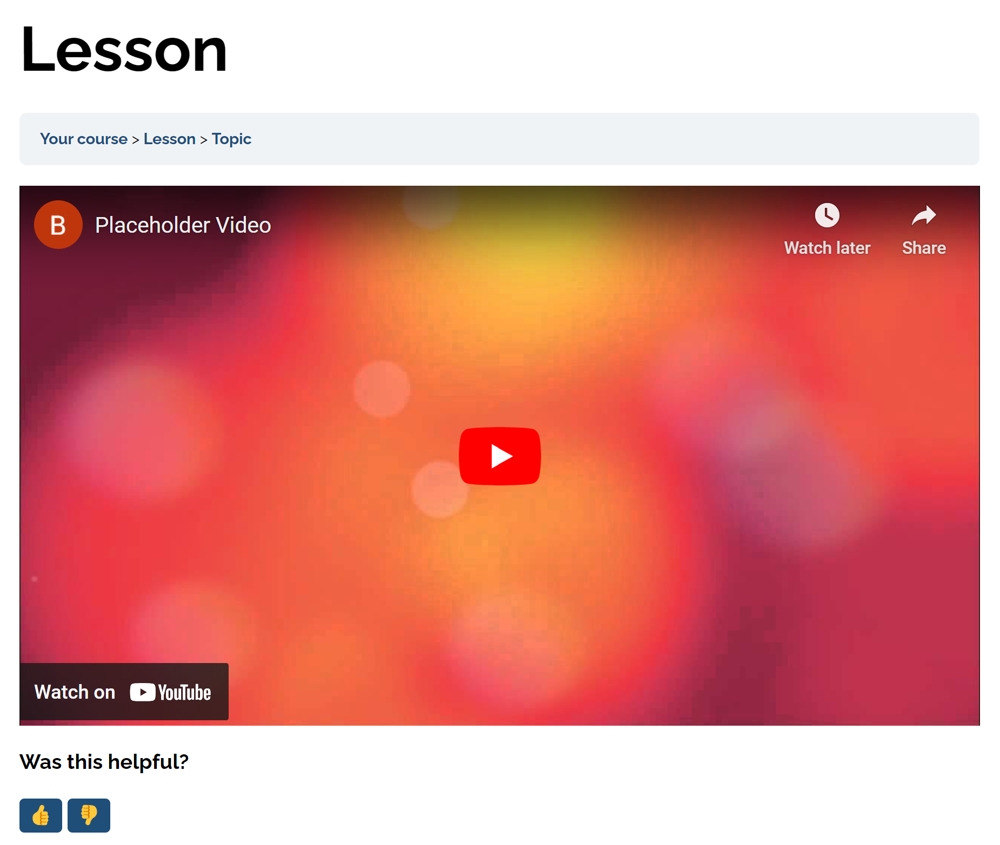

# Feedback widget for LearnDash

This guide will walk you through installing a feedback widget in LearnDash CMS to gather user feedback on your courses, lessons, quizzes, or topics. We will cover two installation modes: **Basic installation** (automatic placement) and **Advanced setup** (custom placement).

## Prerequisites

Before you begin, ensure you have the following:

- A PushFeedback account. If you don't have one, [sign up for free](https://app.pushfeedback.com/accounts/signup/).
- A project created in your PushFeedback dashboard. If you haven't created one yet, follow the steps in the [Quickstart](../quickstart.md#2-create-a-project) guide.
- Access to your LearnDash website in [WordPress](wordpress.md).

## Basic installation

To embed the PushFeedback widget into your LearnDash site:

1. Access the admin dashboard of your LearnDash website by navigating to `http://yourwebsite.com/wp-admin/`.

2. Go to **Appearance > Theme Editor**.

3. Add the following code at the end of your theme's `functions.php` file:

    ```php
    function is_learn_dash_fullscreen() {
        return is_singular(array('sfwd-lessons', 'sfwd-quiz', 'sfwd-topic'));
    }

    function enqueue_pushfeedback_scripts_conditionally() {
        if (is_learn_dash_fullscreen()) {
            echo '<link rel="stylesheet" href="https://cdn.jsdelivr.net/npm/pushfeedback/dist/pushfeedback/pushfeedback.css">';
            echo '<script type="module" src="https://cdn.jsdelivr.net/npm/pushfeedback/dist/pushfeedback/pushfeedback.esm.js"></script>';
        }
    }
    add_action('wp_head', 'enqueue_pushfeedback_scripts_conditionally');

    function inject_custom_feedback_widget($content) {
        static $widget_injected = false;
        if (is_learn_dash_fullscreen() && !$widget_injected) {
            $project_id = '<YOUR_PROJECT_ID>'; // Replace with your actual project ID
            
            $widget_html = '
                <feedback-button 
                    project="' . $project_id . '"
                    button-style="dark"
                    modal-position="bottom-right"
                    button-position="bottom-right"
                >
                Share feedback
                </feedback-button>
            ';

            $widget_injected = true;
            return $content . $widget_html;
        }

        return $content;
    }
    add_filter('the_content', 'inject_custom_feedback_widget');
    ```

    Replace `<YOUR_PROJECT_ID>` with your project's ID from the [PushFeedback dashboard](../quickstart.md#2-create-a-project).

4. Save your changes.

5. Visit a LearnDash lesson, topic, or quizz in a web browser. Confirm that the feedback button is visible and operational.



## Advanced setup: Custom placement

This alternative installation method is best for those projects that require granular control over the widget's positioning.

For example, you can use it to embedded PushFeedback at the end of every page as follows:



To embed the PushFeedback widget at the end of every LearnDash lesson, quiz, or topic:

1. Access the admin dashboard of your LearnDash website by navigating to `http://yourwebsite.com/wp-admin/`.

2. Go to **Appearance > Theme Editor**.

3. Add the following code at the end of your theme's `functions.php` file:

    ```php
    function is_learn_dash_fullscreen() {
       // Check if the current page is a LearnDash lesson, quiz, or topic
       return is_singular(array('sfwd-lessons', 'sfwd-quiz', 'sfwd-topic'));
    }

    function enqueue_pushfeedback_scripts_conditionally() {
        if (is_learn_dash_fullscreen()) {
            // Add the PushFeedback CSS and JS
            echo '<link rel="stylesheet" href="https://cdn.jsdelivr.net/npm/pushfeedback/dist/pushfeedback/pushfeedback.css">';
            echo '<style>:root {--feedback-primary-color: #1f4e79;}</style>';
            echo '<script type="module" src="https://cdn.jsdelivr.net/npm/pushfeedback/dist/pushfeedback/pushfeedback.esm.js"></script>';
        }
    }
    add_action('wp_head', 'enqueue_pushfeedback_scripts_conditionally');

    function inject_custom_feedback_widget($content) {
        static $widget_injected = false;
        if (is_learn_dash_fullscreen() && !$widget_injected) {
            $project_id = '<YOUR PROJECT ID>'; // Replace with your actual project ID
            
            $widget_html = '
                <div class="feedback-widget">
                    <p><b>Was this helpful?</b></p>
                    <span class="feedback-widget-positive">
                        <feedback-button 
                            project="' . $project_id . '"
                            button-style="dark"
                            modal-position="bottom-right"
                            button-position="default"
                        >
                        <button class="button button--outline button--dark button--sm" title="Yes">👍</button>
                        </feedback-button>
                    </span>
                    <span class="feedback-widget-negative margin-left--sm">
                        <feedback-button 
                            project="' . $project_id . '"
                            button-style="dark"
                            modal-position="bottom-right"
                            button-position="default"
                        >
                        <button class="button button--outline button--dark button--sm" title="No">👎</button>
                        </feedback-button>
                    </span>
                </div>
            ';

            $widget_injected = true;
            return $content . $widget_html;
        }

        return $content;
    }
    add_filter('the_content', 'inject_custom_feedback_widget');
    ```

    Replace `<YOUR_PROJECT_ID>` with your project's ID from the [PushFeedback dashboard](../quickstart.md#2-create-a-project).

4. Save your changes.

5. Visit a LearnDash lesson, topic, or quizz in a web browser. Confirm that the feedback button is visible and operational.

## Next steps

For more about customization and additional features exploration, check out the [Configuration](/category/configuration) section.