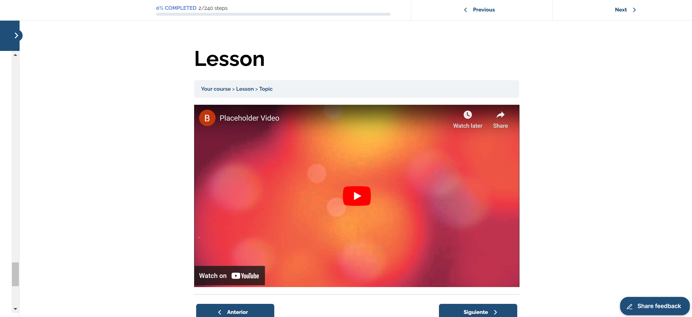
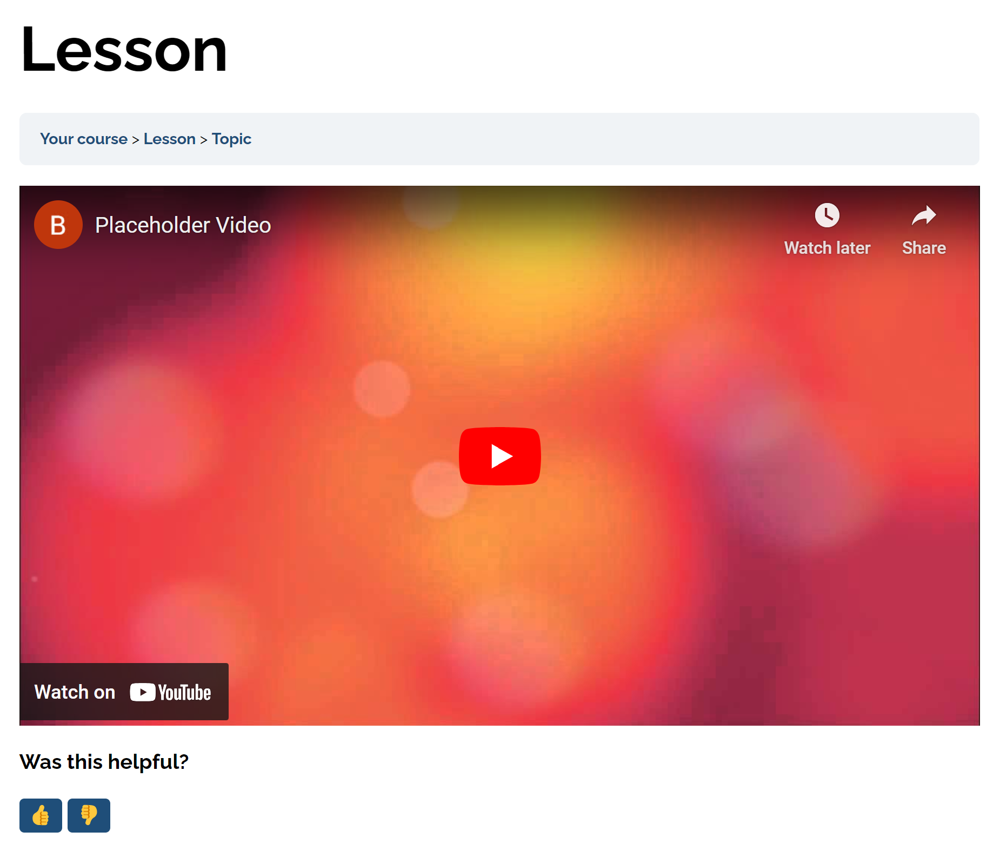

# Feedback widget for LearnDash

PushFeedback collects user feedback directly from your website. This guide covers installation in LearnDash, with options for automatic and custom widget placement.

## Prerequisites

Before you begin, you need:

- A PushFeedback account. If you don't have one, [sign up for free](https://app.pushfeedback.com/accounts/signup/).
- A project created in your PushFeedback dashboard. If you haven't created one yet, follow the steps in the [Quickstart](../quickstart.md#2-create-a-project) guide.
- Access to your LearnDash website in [WordPress](wordpress.md).

## Basic installation

1. Access the admin dashboard of your LearnDash website by navigating to `http://yourwebsite.com/wp-admin/`.

2. Go to **Appearance > Theme Editor**.

3. Add the following code at the end of your theme's `functions.php` file:

    ```php
    function is_learn_dash_fullscreen() {
        return is_singular(array('sfwd-lessons', 'sfwd-quiz', 'sfwd-topic'));
    }

    function enqueue_pushfeedback_scripts_conditionally() {
        if (is_learn_dash_fullscreen()) {
            echo '<link rel="stylesheet" href="https://cdn.jsdelivr.net/npm/pushfeedback/dist/pushfeedback/pushfeedback.css">';
            echo '<script type="module" src="https://cdn.jsdelivr.net/npm/pushfeedback/dist/pushfeedback/pushfeedback.esm.js"></script>';
        }
    }
    add_action('wp_head', 'enqueue_pushfeedback_scripts_conditionally');

    function inject_custom_feedback_widget($content) {
        static $widget_injected = false;
        if (is_learn_dash_fullscreen() && !$widget_injected) {
            $project_id = '<YOUR_PROJECT_ID>'; // Replace with your actual project ID
            
            $widget_html = '
                <feedback-button 
                    project="' . $project_id . '"
                    button-style="dark"
                    modal-position="bottom-right"
                    button-position="bottom-right"
                >
                Share feedback
                </feedback-button>
            ';

            $widget_injected = true;
            return $content . $widget_html;
        }

        return $content;
    }
    add_filter('the_content', 'inject_custom_feedback_widget');
    ```

    Replace `<YOUR_PROJECT_ID>` with your project's ID from the [PushFeedback dashboard](../quickstart.md#2-create-a-project).

4. Save your changes.

5. Visit a LearnDash lesson, topic, or quizz in a web browser. Confirm that the feedback button is visible and operational.



## Advanced setup: Custom placement

For example, embed PushFeedback at the end of every page:



1. Access the admin dashboard of your LearnDash website by navigating to `http://yourwebsite.com/wp-admin/`.

2. Go to **Appearance > Theme Editor**.

3. Add the following code at the end of your theme's `functions.php` file:

    ```php
    function is_learn_dash_fullscreen() {
       // Check if the current page is a LearnDash lesson, quiz, or topic
       return is_singular(array('sfwd-lessons', 'sfwd-quiz', 'sfwd-topic'));
    }

    function enqueue_pushfeedback_scripts_conditionally() {
        if (is_learn_dash_fullscreen()) {
            // Add the PushFeedback CSS and JS
            echo '<link rel="stylesheet" href="https://cdn.jsdelivr.net/npm/pushfeedback/dist/pushfeedback/pushfeedback.css">';
            echo '<style>:root {--feedback-primary-color: #1f4e79;}</style>';
            echo '<script type="module" src="https://cdn.jsdelivr.net/npm/pushfeedback/dist/pushfeedback/pushfeedback.esm.js"></script>';
        }
    }
    add_action('wp_head', 'enqueue_pushfeedback_scripts_conditionally');

    function inject_custom_feedback_widget($content) {
        static $widget_injected = false;
        if (is_learn_dash_fullscreen() && !$widget_injected) {
            $project_id = '<YOUR PROJECT ID>'; // Replace with your actual project ID
            
            $widget_html = '
                <div class="feedback-widget">
                    <p><b>Was this helpful?</b></p>
                    <span class="feedback-widget-positive">
                        <feedback-button 
                            project="' . $project_id . '"
                            button-style="dark"
                            modal-position="bottom-right"
                            button-position="default"
                        >
                        <button class="button button--outline button--dark button--sm" title="Yes">👍</button>
                        </feedback-button>
                    </span>
                    <span class="feedback-widget-negative margin-left--sm">
                        <feedback-button 
                            project="' . $project_id . '"
                            button-style="dark"
                            modal-position="bottom-right"
                            button-position="default"
                        >
                        <button class="button button--outline button--dark button--sm" title="No">👎</button>
                        </feedback-button>
                    </span>
                </div>
            ';

            $widget_injected = true;
            return $content . $widget_html;
        }

        return $content;
    }
    add_filter('the_content', 'inject_custom_feedback_widget');
    ```

    Replace `<YOUR_PROJECT_ID>` with your project's ID from the [PushFeedback dashboard](../quickstart.md#2-create-a-project).

4. Save your changes.

5. Visit a LearnDash lesson, topic, or quizz in a web browser. Confirm that the feedback button is visible and operational.

## Next steps

Choose what to do next:

- [Customization](/category/customization) — Adjust the widget's layout, styles, and text.
- [Integrations](/category/integrations) — Forward feedback to Slack, email, Jira, and more.