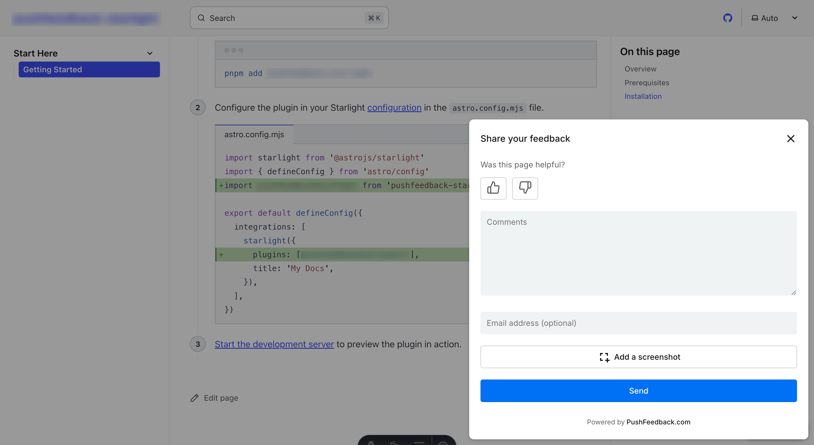

# Feedback widget for Nextra

PushFeedback collects user feedback directly from your website. This guide covers installation in a Nextra project.



## Prerequisites

Before you begin, you need:

- A PushFeedback account. If you don't have one, [sign up for free](https://app.pushfeedback.com/accounts/signup/).
- A project created in your PushFeedback dashboard. If you haven't created one yet, follow the steps in the [Quickstart](../quickstart.md#2-create-a-project) guide.
- A Nextra site and Node.js installed.

## Installation

1. Install PushFeedback:

    ```console
    npm install pushfeedback-react
    ```

    :::info
    If you're using yarn as your package manager, run `yarn add pushfeedback-react` instead of the npm command above.
    :::

1. Create a new component file `components/FeedbackWidget.tsx` (or `components/FeedbackWidget.jsx` for JavaScript) with the following content:

    ```tsx
    import React, { useEffect } from 'react';
    import { FeedbackButton } from 'pushfeedback-react';
    import { defineCustomElements } from 'pushfeedback/loader';
    import 'pushfeedback/dist/pushfeedback/pushfeedback.css';

    export default function FeedbackWidget() {
        useEffect(() => {
            if (typeof window !== 'undefined') {
                defineCustomElements(window);
            }
        }, []);

        return (
            <FeedbackButton 
                project="<YOUR_PROJECT_ID>" 
                button-position="bottom-right" 
                modal-position="bottom-right" 
                button-style="dark">
                Feedback
            </FeedbackButton>
        );
    }
    ```

    Replace `<YOUR_PROJECT_ID>` with your project's ID from the [PushFeedback dashboard](../quickstart.md#2-create-a-project).

1. Update your Nextra theme configuration file (`theme.config.tsx` or `theme.config.jsx`) to include the feedback widget. If you're using the Nextra Docs theme, add it to the `main` function:

    ```tsx
    import FeedbackWidget from './components/FeedbackWidget'

    export default {
      // ... other config options
      main: ({ children }) => {
        return (
          <>
            {children}
            <FeedbackWidget />
          </>
        )
      }
    }
    ```

1. Start your Nextra project by running `npm run dev` or `yarn dev` in your terminal. Once it compiles successfully, verify that the feedback button appears and functions correctly on your site.

## Next steps

Choose what to do next:

- [Customization](/category/customization) — Adjust the widget's layout, styles, and text.
- [Integrations](/category/integrations) — Forward feedback to Slack, email, Jira, and more.

