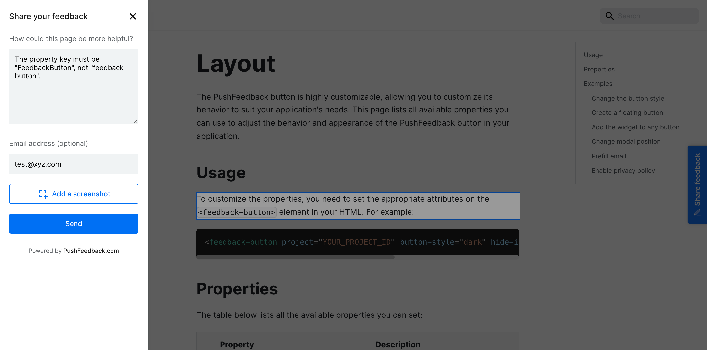

# Feedback widget for NPM projects

Here's a step-by-step guide to help you install PushFeedback in your project using NPM.



## Prerequisites

Before you begin, you'll need to have the following:

- A PushFeedback account. If you don't have one, [sign up for free](https://app.pushfeedback.com/accounts/signup/).
- A project created in your PushFeedback dashboard. If you haven't created one yet, follow the steps in the [Quickstart](../quickstart.md#2-create-a-project) guide.
- Node.js installed.


## Installation

To integrate the PushFeedback widget into your site:

1. Open your terminal or command prompt. Navigate to your project's root directory using the `cd` command:

    ```console
    cd path/to/your/project
    ```
    
    Replace `path/to/your/project` with your project's actual directory path.

2. With your terminal still open, run the following command to install PushFeedback:

    ```console
    npm install pushfeedback
    ```

3. Make sure you embed the styles and scripts in your primary JS or entry file:

    ```js
    // Incorporate PushFeedback styles
    import 'pushfeedback/dist/pushfeedback/pushfeedback.css';

    // Initialize the PushFeedback widget
    import 'pushfeedback/dist/pushfeedback/pushfeedback.esm.js';
    ```

4. Just before the closing `</body>` tag of your website's HTML, add the following snippet:

    ```html
    <feedback-button project="<YOUR_PROJECT_ID>" button-position="bottom-right" modal-position="bottom-right" button-style="dark">Feedback</feedback-button>
    ```

    Replace `<YOUR_PROJECT_ID>` with your project's ID from the [PushFeedback dashboard](../quickstart.md#2-create-a-project).

1. Open the website in a web browser to verify the feedback button appears and works correctly.

## Next steps

For more about customization and additional features exploration, check out the [Customization](/category/customization) section.

Need assistance? We're here to help! Reach out to us at [PushFeedback Support](https://pushfeedback.com/contact).