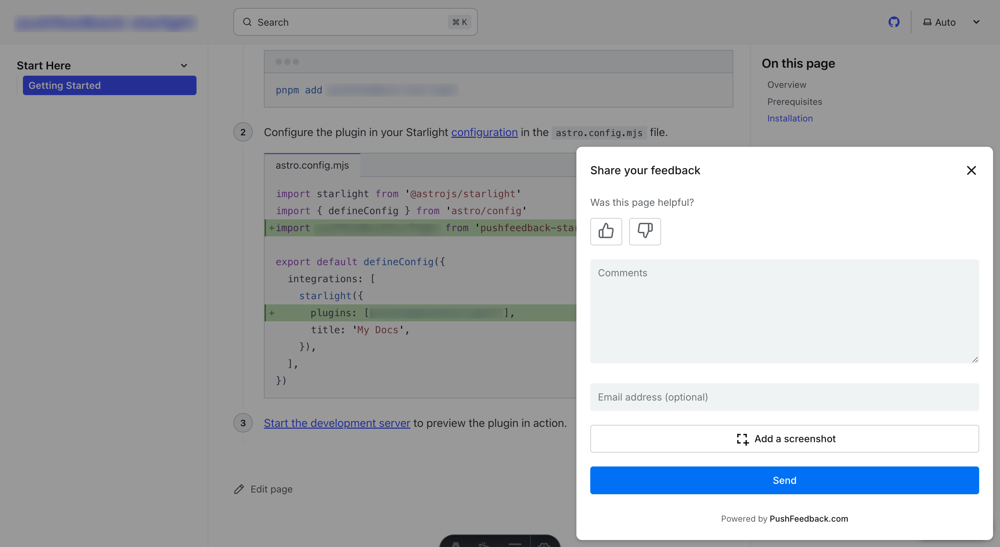

# Feedback widget for Paligo

Here's a step-by-step guide to help you install PushFeedback in your Paligo documentation.



## Prerequisites

Before you begin, you'll need to have the following:

- A PushFeedback account. If you don't have one, [sign up for free](https://app.pushfeedback.com/accounts/signup/).
- A project created in your PushFeedback dashboard. If you haven't created one yet, follow the steps in the [Quickstart](../quickstart.md#2-create-a-project) guide.
- A Paligo account with publishing permissions.

## Installation

To embed the PushFeedback widget into your Paligo documentation:

1. Log in to your Paligo account and open your publication.

1. Navigate to **Settings > Layout** and select the HTML5 layout you want to modify.

1. In the Layout Editor, go to the **Scripts** section.

1. In the **Head Section** field, add the following code to load the PushFeedback styles and scripts:

    ```html
    <link rel="stylesheet" href="https://cdn.jsdelivr.net/npm/pushfeedback/dist/pushfeedback/pushfeedback.css"/>
    <script type="module" src="https://cdn.jsdelivr.net/npm/pushfeedback/dist/pushfeedback/pushfeedback.esm.js"></script>
    ```

1. In the **Body Section** field (or **Footer Section** if available), add the feedback button:

    ```html
    <feedback-button project="<YOUR_PROJECT_ID>" button-position="bottom-right" modal-position="bottom-right" button-style="dark">Feedback</feedback-button>
    ```

    Replace `<YOUR_PROJECT_ID>` with your project's ID from the [PushFeedback dashboard](../quickstart.md#2-create-a-project).

1. Save your layout changes.

1. Publish your Paligo documentation using the modified layout.

1. Open your published documentation in a web browser to verify the feedback button appears and functions correctly.

## Alternative: Using Custom CSS/JS Files

If your Paligo layout supports custom CSS and JavaScript files:

1. Create a JavaScript file with the following content:

    ```js
    // Load PushFeedback
    (function() {
        var link = document.createElement('link');
        link.rel = 'stylesheet';
        link.href = 'https://cdn.jsdelivr.net/npm/pushfeedback/dist/pushfeedback/pushfeedback.css';
        document.head.appendChild(link);

        var script = document.createElement('script');
        script.type = 'module';
        script.src = 'https://cdn.jsdelivr.net/npm/pushfeedback/dist/pushfeedback/pushfeedback.esm.js';
        document.head.appendChild(script);

        script.onload = function() {
            var feedbackButton = document.createElement('feedback-button');
            feedbackButton.setAttribute('project', '<YOUR_PROJECT_ID>');
            feedbackButton.setAttribute('button-position', 'bottom-right');
            feedbackButton.setAttribute('modal-position', 'bottom-right');
            feedbackButton.setAttribute('button-style', 'dark');
            feedbackButton.textContent = 'Feedback';
            document.body.appendChild(feedbackButton);
        };
    })();
    ```

    Replace `<YOUR_PROJECT_ID>` with your project's ID from the [PushFeedback dashboard](../quickstart.md#2-create-a-project).

1. Upload this file to your Paligo resources and reference it in your layout's Scripts section.

## Next steps

For more about customization and additional features exploration, check out the [Customization](/category/customization) section.

Need assistance? We're here to help! Reach out to us at [PushFeedback Support](https://pushfeedback.com/contact).

