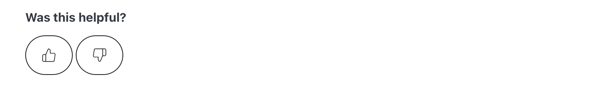

import Tabs from '@theme/Tabs';
import TabItem from '@theme/TabItem';

# Feedback widget for Starlight

Here's a step-by-step guide to help you install PushFeedback in your Starlight (Astro) project.


## Prerequisites

Before you begin, you'll need to have the following:

- A PushFeedback account. If you don't have one, [sign up for free](https://app.pushfeedback.com/accounts/signup/).
- A project created in your PushFeedback dashboard. If you haven't created one yet, follow the steps in the [Quickstart](../quickstart.md#2-create-a-project) guide.
- A Starlight site.

## Installation

To integrate the PushFeedback widget into your Starlight site:

1. Go to `src/components`. If `components` does not exist, create the directory.
1. Create a new file `CustomFooter.astro` under your docs project `src/components` directory with the following content:

    ```astro
    ---
    import type { Props } from '@astrojs/starlight/props';

    import EditLink from 'virtual:starlight/components/EditLink';
    import LastUpdated from 'virtual:starlight/components/LastUpdated';
    import Pagination from 'virtual:starlight/components/Pagination';
    import config from 'virtual:starlight/user-config';
    ---

    <footer class="sl-flex">
        <feedback-button
            project="<YOUR_PROJECT_ID>"
            button-position="bottom-right"
            modal-position="bottom-right"
            button-style="dark">
                Feedback
        </feedback-button>

        <div class="meta sl-flex">
            <EditLink {...Astro.props} />
            <LastUpdated {...Astro.props} />
        </div>
        <Pagination {...Astro.props} />

        {
            config.credits && (
                <a class="kudos sl-flex" href="https://starlight.astro.build">
                    <Icon name={'starlight'} /> {Astro.locals.t('builtWithStarlight.label')}
                </a>
            )
        }
    </footer>

    <style is:global>
        .right-sidebar-container{
            z-index: -1;
        } 
    </style>

    <style>
        footer {
            flex-direction: column;
            gap: 1.5rem;
        }
        .meta {
            gap: 0.75rem 3rem;
            justify-content: space-between;
            flex-wrap: wrap;
            font-size: var(--sl-text-sm);
            color: var(--sl-color-gray-3);
        }
        .meta > :global(p:only-child) {
            margin-inline-start: auto;
        }

        .kudos {
            align-items: center;
            gap: 0.5em;
            margin: 1.5rem auto;
            font-size: var(--sl-text-xs);
            text-decoration: none;
            color: var(--sl-color-gray-3);
        }
        .kudos :global(svg) {
            color: var(--sl-color-orange);
        }
        .kudos:hover {
            color: var(--sl-color-white);
        }
    </style>
    ```
    
    This code snippet shows how to integrate the PushFeedback widget. Pay special attention to the lines:

    ```astro
    <feedback-button
        project="<YOUR_PROJECT_ID>"
        button-position="bottom-right"
        modal-position="bottom-right"
        button-style="dark">
            Feedback
    </feedback-button>
    ```

    Replace `<YOUR_PROJECT_ID>` with your project's ID from the [PushFeedback dashboard](../quickstart.md#2-create-a-project).

    And the global style:

    ```astro
    <style is:global>
        .right-sidebar-container{
            z-index: -1;
        } 
    </style>
    ```

    This is required to make sure the button is placed on top of the right sidebar.
    
1. Load the dependencies in your Astro configuration file (`astro.config.mjs`):

    ```js
    import starlight from '@astrojs/starlight'
    import { defineConfig } from 'astro/config'

    export default defineConfig({
      integrations: [
        starlight({
          head: [
            {
              tag: 'link',
              attrs: {
                rel: 'stylesheet',
                href: 'https://cdn.jsdelivr.net/npm/pushfeedback/dist/pushfeedback/pushfeedback.css',
              },
            },
            {
              tag: 'script',
              attrs: {
                type: 'module',
                src: 'https://cdn.jsdelivr.net/npm/pushfeedback/dist/pushfeedback/pushfeedback.esm.js',
              },
            },
          ],
          (...)
        }),
      ],
    })
    ```

1. Load the custom component you've created by overriding the default footer with `CustomFooter.astro`:

    ```js
    import starlight from '@astrojs/starlight'
    import { defineConfig } from 'astro/config'

    export default defineConfig({
      integrations: [
        starlight({
          (...)
          components: {
            Footer: './src/components/CustomFooter.astro',
          },
          (...)
        }),
      ],
    })
    ```

1. Start your Starlight project by running `npm run dev` in your terminal. Once it compiles successfully, verify that the feedback button appears and functions correctly on your site.


## Advanced setup: Like and dislike buttons

To embed PushFeedback with like and dislike buttons at the end of every page:



Follow the previous steps, but replace the following code in your `CustomFooter.astro` file:

```astro
<feedback-button
    project="<YOUR_PROJECT_ID>"
    button-position="bottom-right"
    modal-position="bottom-right"
    button-style="dark">
        Feedback
</feedback-button>
```

With the following:

```astro
<div className="feedback-widget">
    <div style="margin-bottom: 10px;"><b>Was this helpful?</b></div>
    <span class="feedback-widget-positive" title="Yes">
        <feedback-button project="<YOUR_PROJECT_ID>" rating="1" button-style="default" modal-position="center">
            <LinkButton variant="secondary">
                <svg xmlns="http://www.w3.org/2000/svg" width="20" height="20" viewBox="0 0 24 24" fill="none" stroke="currentColor" strokeWidth="2" strokeLinecap="round" strokeLinejoin="round">
                    <path d="M14 9V5a3 3 0 0 0-3-3l-4 9v11h11.28a2 2 0 0 0 2-1.7l1.38-9a2 2 0 0 0-2-2.3zM7 22H4a2 2 0 0 1-2-2v-7a2 2 0 0 1 2-2h3"></path>
                </svg>
            </LinkButton>
        </feedback-button>
    </span>
    <span class="feedback-widget-negative">
        <feedback-button project="<YOUR_PROJECT_ID>" rating="0" button-style="default" modal-position="center">
            <LinkButton variant="secondary" title="No">
                <svg xmlns="http://www.w3.org/2000/svg" width="20" height="20" viewBox="0 0 24 24" fill="none" stroke="currentColor" strokeWidth="2" strokeLinecap="round" strokeLinejoin="round">
                    <path d="M10 15v4a3 3 0 0 0 3 3l4-9V2H5.72a2 2 0 0 0-2 1.7l-1.38 9a2 2 0 0 0 2 2.3zm7-13h2.67A2.31 2.31 0 0 1 22 4v7a2.31 2.31 0 0 1-2.33 2H17"></path>
                </svg>
            </LinkButton>
        </feedback-button>
    </span>
</div>
```

Remember to replace `<YOUR_PROJECT_ID>` with your project's ID from the [PushFeedback dashboard](../quickstart.md#2-create-a-project).

## Next steps

For more about customization and additional features exploration, check out the [Customization](/category/customization) section.

Need assistance? We're here to help! Reach out to us at [PushFeedback Support](https://pushfeedback.com/contact).
