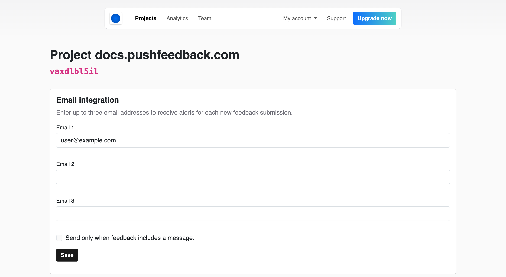

# Email integration

PushFeedback can send email notifications to up to three addresses when users submit feedback.

## Prerequisites

- A PushFeedback account. If you don't have one, [sign up for free](https://app.pushfeedback.com/accounts/signup/).
- A project created in your PushFeedback dashboard. If you haven't created one yet, follow the steps in the [Quickstart](../quickstart.md#2-create-a-project) guide.

## Set up email notifications

1. Open [app.pushfeedback.com](https://app.pushfeedback.com) and log in.

2. Go to **Projects** and select your project.

3. Click **Settings**, then under **Integrations**, select **Email**.

7. Add the email addresses of the team members you'd like to notify when feedback is received.

    :::info
    PushFeedback lets you configure up to three email addresses. If you need to notify more recipients, consider using an email distribution list.
    :::

8. Save your changes by clicking **Save**.

9. To ensure the changes are in place, go to any webpage where you've implemented the PushFeedback widget and send a feedback entry. The specified email addresses should receive the feedback.