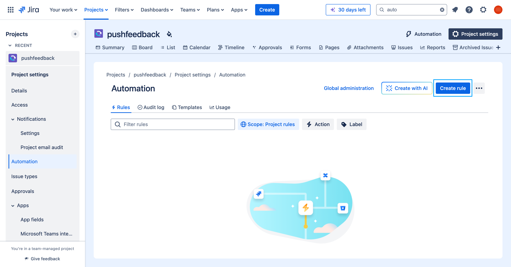
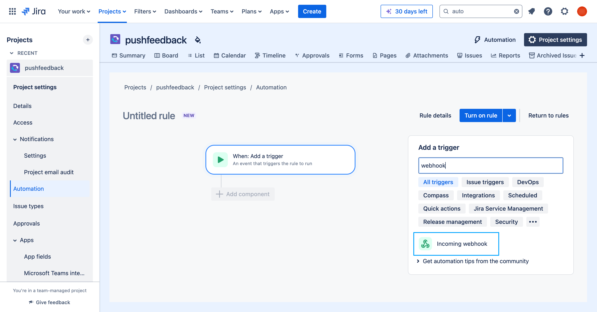
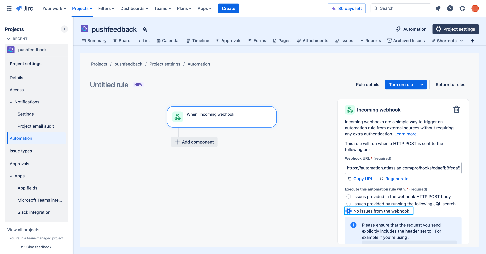
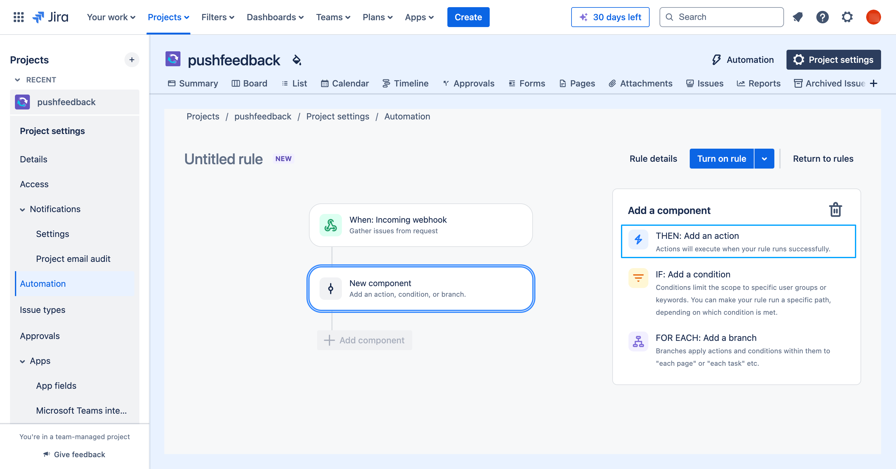
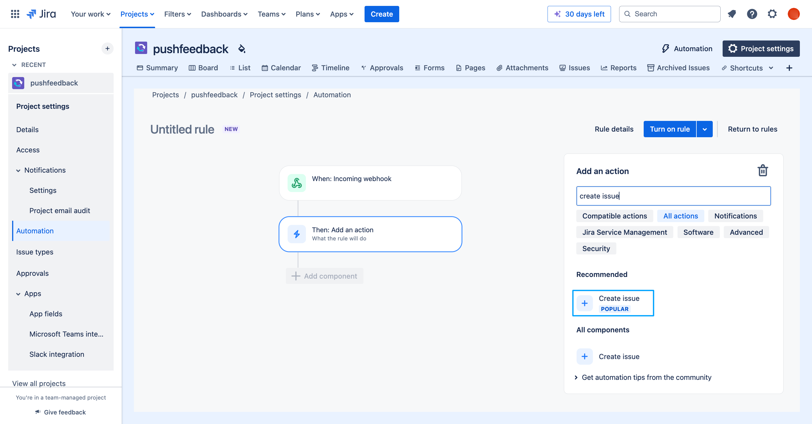
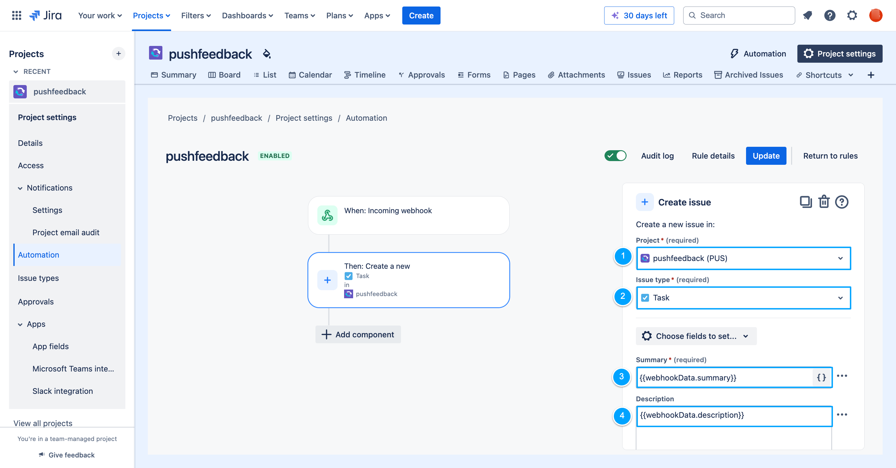
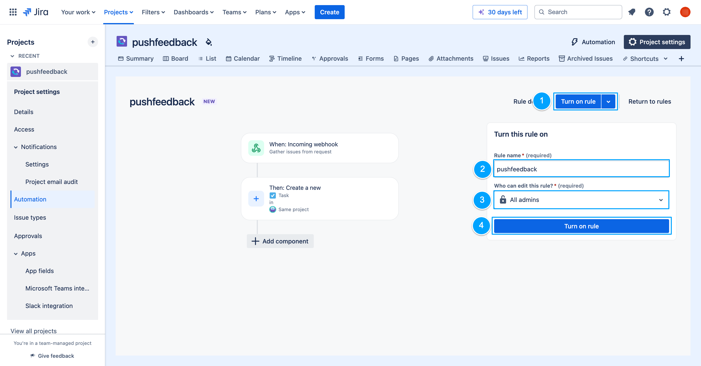
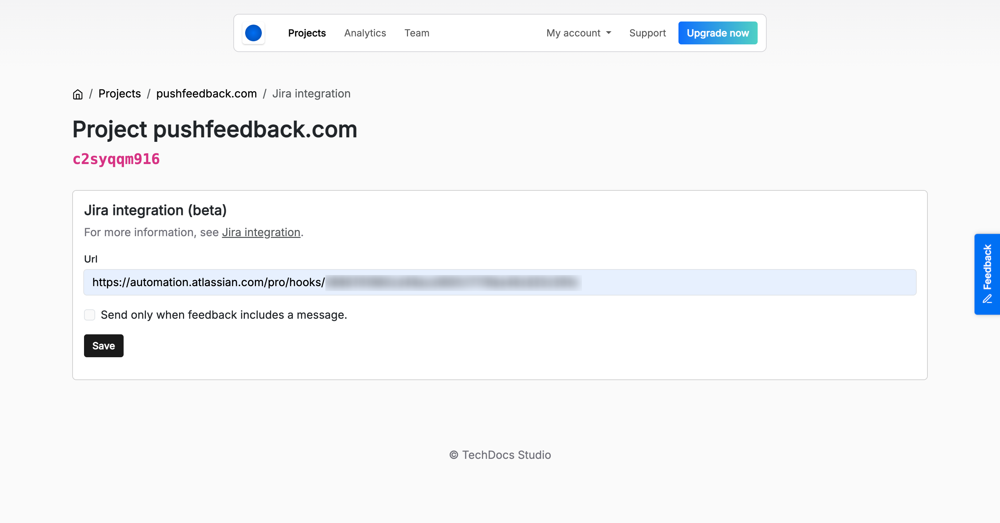
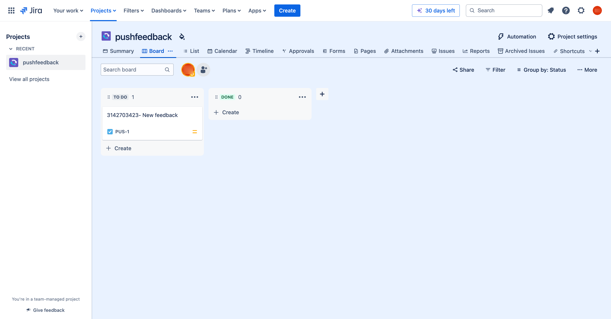

# Jira integration

With PushFeedback, you can forward user feedback directly to your preferred Jira board using [Jira Cloud Automation](https://support.atlassian.com/cloud-automation/docs/jira-cloud-automation/) or [Jira Data Center Automations](https://confluence.atlassian.com/automation/), depending on your distribution.

This integration lets you manage feedback using the same tools for project management, enhancing assignment and tracking of feedback issues.

## Prerequisites

- A PushFeedback account. If you don’t have one, [sign up for free](https://app.pushfeedback.com/accounts/signup/).
- A project created in your PushFeedback dashboard. If you haven’t created one yet, follow the steps in the [Quickstart](../quickstart.md#2-create-a-project) guide.
- A Jira workspace (Cloud or Data Center) with access to Automation options.

## 1. Configure Jira automations

To set up automations in Jira, follow these steps:

1. Go to **Project settings** in your Jira project.
2. Navigate to **Automation** under **Project settings**.
3. Click **Create rule**:

    

4. Choose the **Incoming webhook** trigger:

    

5. Select exclude this automation rule with **No issues from the webhook**:

    

6. Copy the webhook URL and click **Next** – you'll need it in the following section.

7. Create a **Then** component:

    

8. Configure the **Then** component to **Create issue**:

    

    :::tip
    If you don’t see the **Create issue** component, ensure **All actions** is marked.
    :::

10. Configure the **Create issue** action as follows:

    

    1. **Project:** Set the Jira project where you want to create the issue.
    2. **Issue type:** Select the issue type you want to create.
    3. **Summary:** Set to ``{{webhookData.summary}}``.
    4. **Description:** Set to ``{{webhookData.description}}``.

11. Click **Next**.

12. Click **Turn on rule**, set a name for your rule, and assign the necessary permissions:

    

## 2. Configure the webhook in PushFeedback

To activate the Jira integration in PushFeedback, follow these steps:

1. Open [app.pushfeedback.com](https://app.pushfeedback.com).

2. Log in with your account credentials.

3. Once in the dashboard, go to the **Projects** tab.

4. Select the project you wish to configure.

5. In the top-right corner, click on the **Settings** button.

6. Under **Integrations**, select **Jira**.

7. Add the URL of the Jira Automation endpoint obtained in the previous section:

    

8. Save your changes by clicking **Save**.

## 3. Test the integration

To ensure the integration is working correctly, follow these steps:

1. Go to any webpage where you’ve implemented the feedback widget and submit a feedback entry.
2. Confirm the feedback appears on your specified Jira board as a new issue:

    

3. Verify that all relevant details are correctly mapped and visible on the Jira issue.
