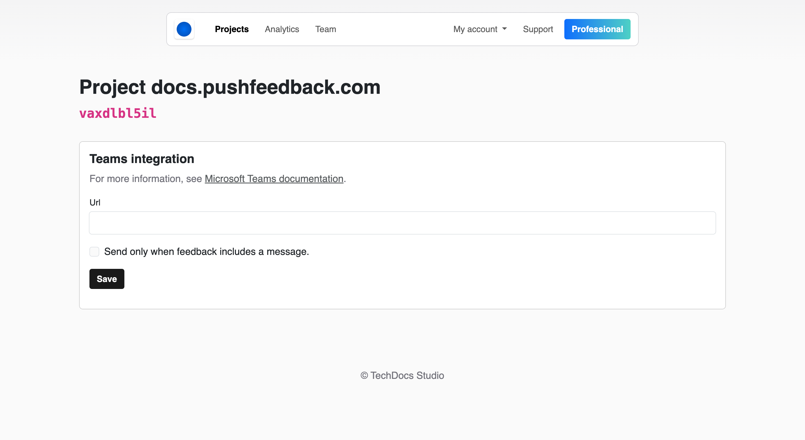

# Teams integration

Using PushFeedback, you can forward user feedback directly to your preferred Microsoft Teams channel using [incoming webhooks](https://api.slack.com/messaging/webhooks).
This ensures that the right team members are immediately informed, leading to faster responses and a better user experience.

## Prerequisites

- A PushFeedback account. If you don't have one, [sign up for free](https://app.pushfeedback.com/accounts/signup/).
- A project created in your PushFeedback dashboard. If you haven't created one yet, follow the steps in the [Quickstart](../quickstart.md#2-create-a-project) guide.
- A Microsoft Teams workspace.

## Steps

To activate the Teams integration in PushFeedback, follow the steps outlined below:

1. Open [app.pushfeedback.com](https://app.pushfeedback.com).

2. Log in using your account credentials.

3. Once inside the dashboard, go to the **Projects** tab.

4. Select the project you wish to configure.

5. On the top-right corner of the page, click on the **Settings** button.

6. Under **Integrations**, select **Teams**.

7. Add the incoming webhook URL provided by Teams. For detailed instructions on setting up incoming webhooks in Teams, refer to [Microsoft's documentation](https://learn.microsoft.com/en-us/microsoftteams/platform/webhooks-and-connectors/how-to/add-incoming-webhook?tabs=newteams%2Cdotnet).

8. Save your changes by clicking **Save**.

9. To ensure the changes are in place, go to any webpage where you've implemented the PushFeedback widget and send a feedback entry. You should receive a notification in the Teams channel associated with the webhook.
