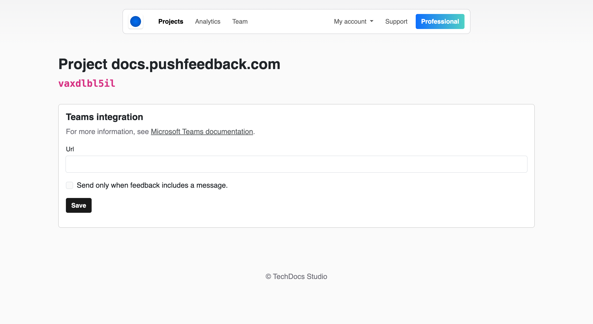

# Teams integration

PushFeedback sends feedback notifications to a Microsoft Teams channel using [incoming webhooks](https://learn.microsoft.com/en-us/microsoftteams/platform/webhooks-and-connectors/how-to/add-incoming-webhook?tabs=newteams%2Cdotnet).

## Prerequisites

- A PushFeedback account. If you don't have one, [sign up for free](https://app.pushfeedback.com/accounts/signup/).
- A project created in your PushFeedback dashboard. If you haven't created one yet, follow the steps in the [Quickstart](../quickstart.md#2-create-a-project) guide.
- A Microsoft Teams workspace.

## Set up the Teams integration

1. Open [app.pushfeedback.com](https://app.pushfeedback.com) and log in.

2. Go to **Projects** and select your project.

3. Click **Settings**, then under **Integrations**, select **Teams**.

7. Add the incoming webhook URL provided by Teams. For detailed instructions on setting up incoming webhooks in Teams, refer to [Microsoft's documentation](https://learn.microsoft.com/en-us/microsoftteams/platform/webhooks-and-connectors/how-to/add-incoming-webhook?tabs=newteams%2Cdotnet).

8. Save your changes by clicking **Save**.

9. To ensure the changes are in place, go to any webpage where you've implemented the PushFeedback widget and send a feedback entry. You should receive a notification in the Teams channel associated with the webhook.
