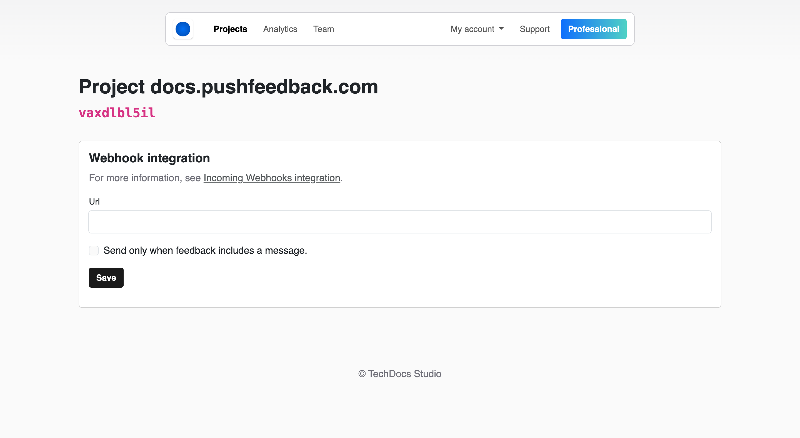

# Incoming Webhooks integration

Webhooks are a powerful way to send real-time data from one application to another. With PushFeedback, you can utilize webhooks to submit user feedback to any URL of your choice once it gets created. This allows you to integrate PushFeedback with your existing workflows and systems.




## Prerequisites

- A PushFeedback account. If you don't have one, [sign up for free](https://app.pushfeedback.com/accounts/signup/).
- A project created in your PushFeedback dashboard. If you haven't created one yet, follow the steps in the [Quickstart](../quickstart.md#2-create-a-project) guide.

## Steps

To activate the webhook integration in PushFeedback and start forwarding user feedback to your desired endpoint, follow the steps outlined below:

1. Open [app.pushfeedback.com](https://app.pushfeedback.com).

2. Log in using your account credentials.

3. Once inside the dashboard, go to the **Projects** tab.

4. Select the project you wish to configure.

5. On the top-right corner of the page, click on the **Settings** button.

6. Under **Integrations**, select **Webhooks**.

7. Add the URL of the endpoint where you want to send the feedback data.

8. Save your changes by clicking **Save**.

9. To ensure the integration is working correctly, go to any webpage where you've implemented the PushFeedback widget and send a feedback entry. The data should be successfully forwarded to the specified endpoint.

## Webhook specification

Here's an example of a webhook payload that PushFeedback sends to the specified URL:


```json
{
  "id": "EVNT-feedback123",
  "object": "event",
  "creation_time": "2024-05-03T08:00:00Z",
  "type": "feedback.created",
  "api_version": "v1",
  "data": {
    "object": "feedback",
    "id": "feedback123",
    "project_id": "https://app.pushfeedback.com/team1/projects/project1/",
    "message": "This is a sample feedback message.",
    "metadata": "Feature A",
    "url": "https://example.com/page",
    "rating": 4,
    "rating_mode": "star",
    "has_screenshot": true,
    "pushfeedback_url": "https://app.pushfeedback.com/team1/projects/project1/",
    "text": "New feedback on PushFeedback: https://app.pushfeedback.com/team1/projects/project1/"
  }
}
```


