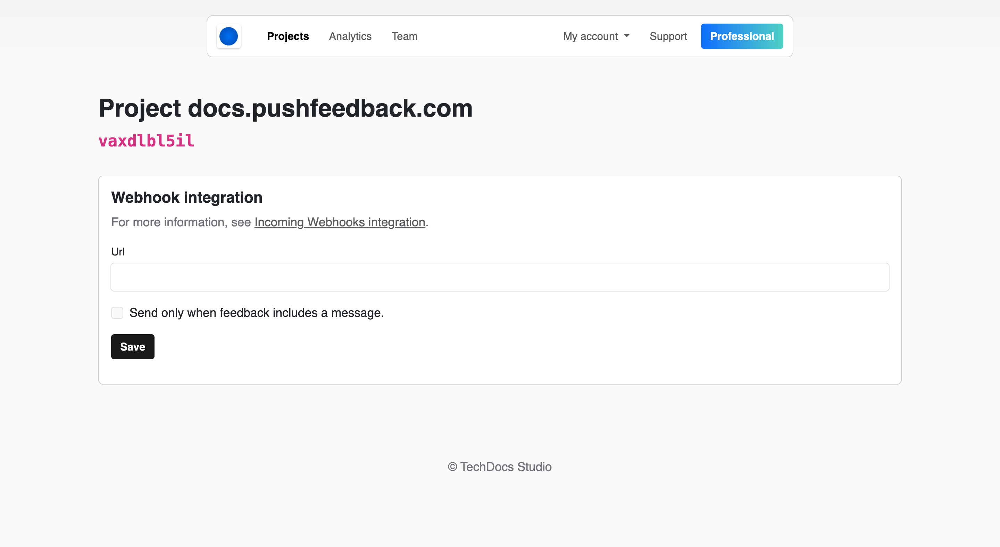

# Zapier integration

PushFeedback sends feedback data to Zapier via webhooks, letting you route it to tools like Trello, Google Sheets, or Salesforce.

## Prerequisites

- A PushFeedback account. If you don't have one, [sign up for free](https://app.pushfeedback.com/accounts/signup/).
- A project created in your PushFeedback dashboard. If you haven't created one yet, follow the steps in the [Quickstart](../quickstart.md#2-create-a-project) guide.
- A Zapier account on a paid plan or during their trial period, as Webhooks by Zapier is a built-in tool only available for these users.

## Set up the Zapier integration

1. Open [app.pushfeedback.com](https://app.pushfeedback.com) and log in.

2. Go to **Projects** and select your project.

3. Click **Settings**, then under **Integrations**, select **Webhooks**.

7. Add the URL of the Zapier endpoint where you want to send the feedback data and configure your Zap on Zapier. For detailed instructions on setting up incoming webhooks in Zapier, refer to [Zapier's documentation](https://zapier.com/blog/what-are-webhooks#webhooks-zapier).

8. Save your changes by clicking **Save**.

9. To ensure the integration is working correctly, go to any webpage where you've implemented the PushFeedback widget and send a feedback entry. The data should be successfully forwarded to the specified endpoint.

## Webhook specification

See [Webhook specification](./webhooks.md#webhook-specification).

## Sample integrations

Zapier offers hundreds of integrations with popular apps and services, allowing you to create custom workflows tailored to your needs. Some examples of integrations you can achieve with PushFeedback and Zapier include:

- Sending feedback data to project management tools like Trello or Asana.
- Notifying your team in Slack or Microsoft Teams whenever new feedback is submitted.
- Adding feedback entries to a Google Sheets document for analysis and reporting.
- Integrating with CRM systems like Salesforce to keep track of customer feedback.
