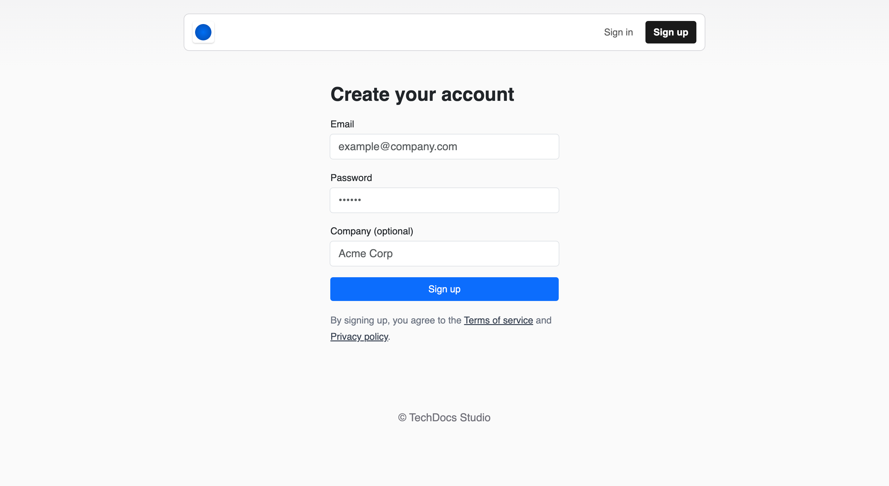
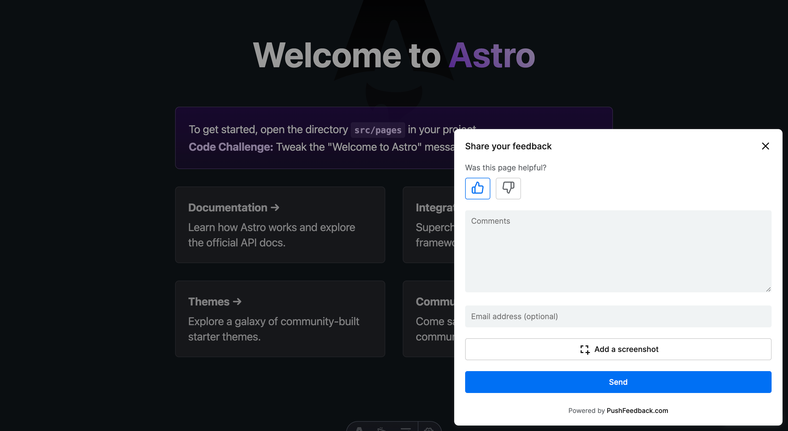

# Quickstart

PushFeedback adds a feedback widget to your documentation or website. Users rate pages, leave comments, and attach screenshots — giving your team actionable input without leaving the site.

In this tutorial, you create a PushFeedback account, set up a project, and add the widget to your site. Later, you can customize its appearance and connect it to tools like Slack or Jira.

## 1. Create your PushFeedback account

1. Open [app.pushfeedback.com](https://app.pushfeedback.com).
2. Click the **Sign Up** button in the top bar.
3. Complete the registration form.

    

After creating your account, create a project to configure the widget.

## 2. Create a project

<div style={{ position: 'relative', paddingTop: '66.42%' }}>
<iframe src="https://player.vimeo.com/video/1014981817?badge=0&amp;autopause=0&amp;player_id=0&amp;app_id=58479" frameBorder="0" allow="autoplay; fullscreen; picture-in-picture; clipboard-write" style={{ position: 'absolute', top: 0, left: 0, width: '100%', height: '100%' }}></iframe></div>
<script src="https://player.vimeo.com/api/player.js"></script>

1. In your PushFeedback dashboard, click the **Projects** tab in the top navbar.
2. Click the **Create project** button.
3. Step through the wizard:

    * **URL configuration:** Specify the URL where you intend to use the feedback widget. This URL must correspond to the exact domain or subdomain where the widget is used. For example, use `docs.pushfeedback.com` instead of `pushfeedback.com`.
    * **Email notification setup (optional):** Define up to three email addresses to receive notifications.
    * **Get your code snippet:** The final step of the wizard shows your project code snippet, which contains your unique Project ID.

## 3. Add the widget to your site

To integrate the PushFeedback widget into your website:

1. Insert the following code within the `<head>` section of your site's HTML:

    ```html
    <!-- Initialize the PushFeedback widget -->
    <link rel="stylesheet" href="https://cdn.jsdelivr.net/npm/pushfeedback/dist/pushfeedback/pushfeedback.css">
    <script type="module" src="https://cdn.jsdelivr.net/npm/pushfeedback/dist/pushfeedback/pushfeedback.esm.js"></script>
    ```

    :::info
    The above method is the standard way of integrating the widget into an static HTML site. If you're using a particular web framework or content management system, PushFeedback offers tailored installation options and plugins. For detailed guides, refer to our [Installation](/category/installation) documentation.
    :::

1. Just before the closing `</body>` tag of your website's HTML, add the following snippet:

    ```html
    <feedback-button project="<YOUR_PROJECT_ID>" button-position="bottom-right" modal-position="bottom-right" button-style="dark">Feedback</feedback-button>
    ```

    Replace `<YOUR_PROJECT_ID>` with your project's ID you obtained from the previous step.

1. You should see the widget installed in your site:

    

## 4. Customize the widget

The widget supports the following customization options:

* **Layout:** Choose the widget's placement on your site—bottom right, top left, or even integrate it with an existing button.

* **Styles:** Modify colors, fonts, and more to ensure the widget harmonizes with your site's aesthetics.

* **Text:** Adapt the widget's text to mirror your site's tone or language.

For detailed configuration steps, see our [Customization](/category/customization) documentation.

## Next steps

Choose what to do next:

- [Customization](/category/customization) — Adjust the widget's layout, styles, and text.
- [Integrations](/category/integrations) — Forward feedback to Slack, email, Jira, and more.
- [Dashboard](https://app.pushfeedback.com) — Monitor and analyze incoming feedback.
