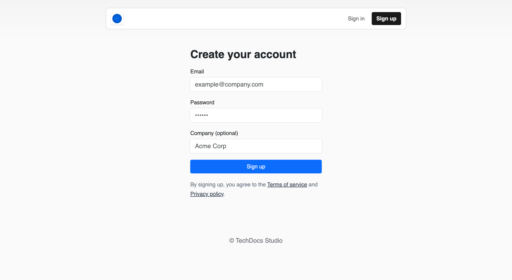

# Quickstart

Welcome to the PushFeedback documentation! In a few minutes, you'll have the PushFeedback widget up and running on your site.

## 1. Create your PushFeedback account

To use the PushFeedback widget, start by setting up your account:


1. Open [app.pushfeedback.com](https://app.pushfeedback.com).
2. Click on the **Sign Up** button located in the top bar.
3. Follow the on-screen instructions to set up your account.

    

With your account ready, move on to creating your first project.

## 2. Create a project

Follow these steps to initiate a new project:

1. In your PushFeedback dashboard, click the **Projects** tab in the top navbar.
2. Click the **Create project** button.
3. Step through the wizard, providing details about your project as prompted:

    

    1. **URL configuration:** Enter the URL where you plan to install the feedback widget. Remember, this should be a specific subdomain (e.g., docs.pushfeedback.com), not the primary domain.
    2.  **Email notification setup (optional):** You have the option to define up to three email addresses that will receive notifications. This step is optional, but if you want immediate alerts for feedback, it's beneficial.
    3. **Get your code snippet**: The final step of the wizard will present a pre-populated code snippet tailored to your project. This code contains your unique Project ID and is ready for integration with your website.

## 3. Add the widget to your site

To integrate the PushFeedback widget into your website:

1. Insert the following code within the `<head>` section of your site's HTML:

    ```html
    <!-- Initialize the PushFeedback widget -->
    <link rel="stylesheet" href="https://cdn.jsdelivr.net/npm/pushfeedback/dist/pushfeedback/pushfeedback.css">
    <script type="module" src="https://cdn.jsdelivr.net/npm/pushfeedback/dist/pushfeedback/pushfeedback.esm.js"></script>
    ```

    :::info
    The above method is the standard way of integrating the widget into an static HTML site. If you're using a particular web framework or content management system, PushFeedback offers tailored installation options and plugins. For a comprehensive guides, refer to our [Installation](/category/installation) documentation.
    :::

1. Just before the closing `</body>` tag of your website's HTML, add the following snippet:

    ```html
    <feedback-button project="<YOUR_PROJECT_ID>" button-position="bottom-right" modal-position="bottom-right" button-style="light">Feedback</feedback-button>
    ```

Replace `<YOUR_PROJECT_ID>` with your project's ID you obtained from the previous step.


## 4. Customize the widget

Get the PushFeedback widget to blend with your website's design and functionality. Here's a quick look at some customization options:

* **Position:** Choose the widget's placement on your site—bottom right, top left, or even integrate it with an existing button.

* **Look and feel:** Modify colors, fonts, and more to ensure the widget harmonizes with your site's aesthetics.

* **Text:** Adapt the widget's text to mirror your site's tone or language.

For detailed configuration steps, see our [Configuration](/category/configuration) documentation.

## Next steps

Congratulations on setting up the PushFeedback widget! Now, your users can submit feedback from your site.

Stay proactive. Monitor your [dashboard](https://apps.pushfeedback.com) to gain insights from user feedback and improve your website accordingly.
